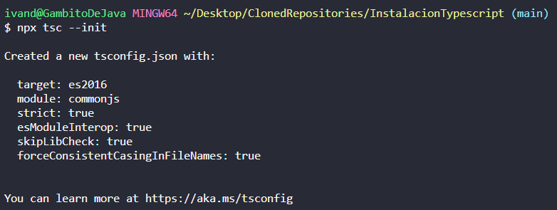
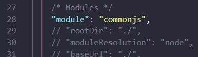
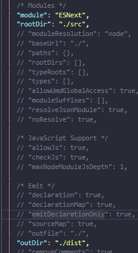

# TypeScript

Es un SuperSet de JS. Esta herramienta tiene las características de ser **fuertemente tipado** y facilita el **escalado**.

Para trabajar con él necesitamos integrar todas las herramientas con TypeScript. Para eso necesitamos modificar nuestras instalaciones iniciales.

## Instalando TypeScript

1. Comenzamos a partir de un repositorio [con todo lo anterior instalado (eslint, jest, babel...)](https://github.com/SemperFenix/boilerPlate/blob/main/readme.md)

   > ## CUIDADO
   >
   > Sólo hacemos la instalación (npm i eslint eslint-config-prettier jest ...) la configuración la haremos después.

   > También podemos copiar un archivo package.json de otro repositorio y ejecutar en la consola `npm i`.

2. Como siempre comenzamos con el comando:

   ```git
     npm i -D typescript
   ```

3. Configuramos de nuevo eslint (`npx eslint --init`), igual que la vez anterior, pero esta vez le decimos que sí queremos usar TypeScript.

4. Creamos una línea en los scripts de package.json que sea `"start":"tsc -w"`:

   ```json
     "scripts": {
       "start": "tsc -w",
       "test": "jest --watchAll --coverage",
       "test:prod": "jest --watchAll --coverage --watchAll=false"
      },
   ```

5. Ejecutamos la instrucción de git:

   ```git
     npx tsc --init
   ```

   

   > En esta configuración vemos que los módulos instalados por defecto son los **commonjs**, pero no son los que nosotros vamos a utilizar, por lo que tenemos que modificarlos.

6. En nuestro directorio raíz creamos las carpetas _src_ (de donde cogerá el archivo) y _dist_ (donde compilará el archivo nuevo).
   Modificamos el archivo _tsconfig.json_ para cambiar el tipo de módulos y su configuración (de dónde cogerá el archivo, dónde lo dejará...):

|               **Estado inicial del archivo**               |     |                  **Estado final del archivo**                  |
| :--------------------------------------------------------: | --- | :------------------------------------------------------------: |
|  |     |  |

7. Creamos dentro de la carpeta _src_ un archivocon extensión **.ts** (por ejemplo: _sample.**ts**_)

8. Ejecutamos el comando que hemos creado en el paso 4:

   ```git
       npm start
   ```

   > Este comando, igual que el de sass o el de test, deja el terminal funcionando y compilando a JS (dentro de la carpeta dist), si queremos ejecutar cualquier comando de git, o bien paramos la consola (Ctrl + C) o bien abrimos otro nuevo terminal para ello.

9. Ahora podemos programar en el archivo de TS y, como hemos dejado la terminal corriendo nos actualizará el archivo JS de la carpeta dist constantemente.

## Usando TypeScript

Typescrip nos añade el tipado a JS. Podemos utilizar un tipado estático o un tipado fuerte:

```Typescript
  // Tipado estático
  let foo = 9
  foo = "Pepe" // Lo podemos hacer, pero nos sugerirá que no

  // Tipado fuerte mediante notación de tipos
  let bar: string;
  bar = 23 // Dará un error

  // Podemos compaginar ambos métodos
  let zoo: boolean = true // Algunos linters no lo permiten
```
