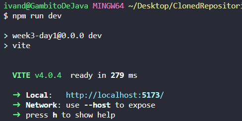
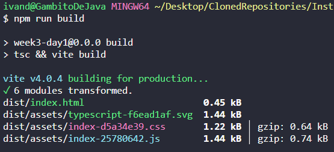

# A tener en cuenta

## Compilando Typescript

A Netlify subiremos un repositorio sin la carpeta _src_, ya que lo que le interesa al usuario son los ficheros JS.

La carpeta _dist_ (donde tenemos nuestros archivos de typescript compilados) no va a subir nunca a GitHub, por lo que necesitamos una herramienta llamada _**taskrunner**_ o _**module bundler**_. Tenemos varias alternativas:

- [Webpack](webpack.js.org) => Le damos ficheros con dependencias y los convierte en static assets.

  - Es el que usaremos con React.

  - Es lento y engorroso de configurar

- [ViteJs](vitejs.dev) => Este lo vamos a utilizar para TS cuando no estemos utilizando React.

- [Parcel](parceljs.org)

## Instalando Vite para vanilla-ts

Podemos seguir las [instrucciones de instalación de su propia web](https://vitejs.dev/guide/).

```git
npm create vite@latest <nombre del proyecto> -- --template vanilla-ts
```

[^1]

> Esta instrucción nos crea la base de un proyecto (una carpeta con los archivos .gitignore, index.html, package.json, tsconfig.json y las carpetas src y public), **pero no instala nada**.
>
> Los ficheros que crea ya vienen configurados para TS.

Vite nos crea una carpeta "public" que es donde estarán todos los ficheros que deben verse en la página final.

A continuación instalamos las dependencias que Vite nos ha creado con:

```git
npm i
```

Cuando queremos ejecutar Vite, utilizamos:

```git
npm run dev
```

Esto compila el proyecto, pero **no crea la carpeta _dist_**, ésta carpeta se "crea" en la RAM del ordenador y accedemos a ella a través del enlace que nos aparece en la terminal al ejecutar el comando `npm run dev`.



Cuando queremos guardar la compilación en nuestro disco, utilizamos:

```git
npm run build
```



Esto nos ha creado la carpeta _dist_. Ahora podemos abrir la carpeta con LiveServer o utilizar el comando `npm run preview`

> La diferencia entre **`npm run dev`** y **`npm run preview`** es que _run dev_ nos muestra de forma actualizada lo que vamos modificando en el archivo de TS (una especie de modo watch que lo deja funcionando); sin embargo, _run preview_ nos muestra la versión final compilada que no va cambiando con lo que modificamos.

## Subir un repo con TypeScript

añadimos en package.json, en la sección de scripts para que Netlify pueda compilar el archivo TS:

```json
"build" : "tsc"
```

En el readme especificamos que será necesario crear la carpeta _dist_ y ejecutar el comando `npm tsc`

[^1]: La instrucción `@latest` se puede usar con cualquier comando npm.
