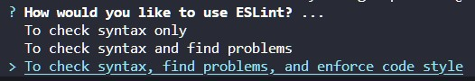
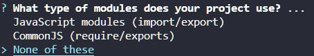
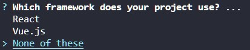
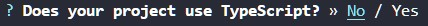
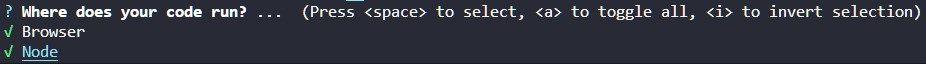
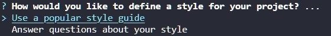
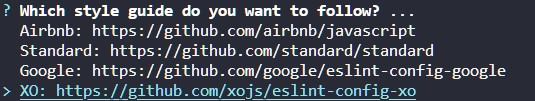
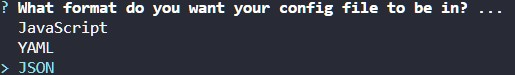

# Boiler plate

- Añadir archivos base:

  - .editorconfig
  - .gitignore (con contenido node_modules)
  - readme.md
  - Ejecutar en el terminal:

    ```git
    npm init
    ```

- Ejecutar en el terminal:

  ```git
    git init
  ```

- Hacer el primer commit para poder pushear el repositorio a remoto:

  ```git
  git add .
  git commit -m'Initial commit'
  ```

- Crear el repositorio en github y ejecutar las tres líneas de código para sincronizar nuestro local con el remoto:

  ```git
  git remote add origin `url del repositorio`
  git branch -M main
  git push -u origin main
  ```

- Comenzar con la instalación de los elementos que necesitemos:

  - Crear una rama para la instalación inicial[^1]:

    ```git
    git checkout -b feature/initial-config
    ```

  - Instalar eslint:

    ```git
    npm install -D eslint eslint-config-prettier
    ```

  - Instalar jest:

    ```git
    npm i -D jest @types/jest @babel/plugin-transform-modules-commonjs
    ```

  - Instalar husky:

    ```git
    npm i -D husky
    ```

- Comenzar la configuración de los paquetes instalados:

  - Ejecutar la configuración de eslint:

    ```git
    npx eslint --init
    ```

    - Las opciones a seleccionar son:

      - 

      - 

      - 

      - 

      - 

      - 

      - 

      - 

      - Para terminar, le permitimos instalar las normas actualizadas a través de **npm**.

  - Configuramos eslint para que funcione adecuadamente con las demás instalaciones:

    - Modificar el archivo eslintrc.json en la sección "extends" para que incluya Prettier:

      ```json
      "extends": ["xo", "prettier"],
      ```

    - Modificar el archivo eslintrc.json en la sección "env" para que incluya jest:

      ```json
      "env": {
        "browser": true,
        "es2021": true,
        "node": true,
        "jest": true
      },
      ```

    - Crear el archivo _jsconfig.json_ para que intellisense nos sugiera código en los archivos de test (snippets para jest), y añadirle esta línea:

      ```json
      { "typeAcquisition": { "include": ["jest"] } }
      ```

  - Modificar el archivo package.json para que los módulos ECM6 funcionen correctamente:

    - Añadir al principio "type":"module":

    ```json
    "name": "week2",
    "version": "1.0.0",
    "description": "Ejercicios semana 2 . Bootcamp Madrid",
    "main": "index.js",
    "type": "module",
    ```

    - Añadir al final la configuración de Babel:

    ```json
    "babel": {
      "env": {
        "test": {
          "plugins": [
            "@babel/plugin-transform-modules-commonjs"
          ]
        }
      }
    }
    ```

    - Añadir el scritp "test" para que al escribir en el terminal "npm test" ejecute nuestros tests:

      ```json
        "scripts": {
          "test": "jest --watchAll",
        },
      ```

- Instalar los huskys, para esto hay dos vías [^2]:

  - Primer camino (sin archivos de husky para copiar)

    - Creamos la carpeta .husky en nuestra raíz, para ello ejecutamos en el terminal:

      ```git
      npx husky install
      ```

    - **Alternativamente** a esto Ejecutar en el terminal:

      ```git
      npx husky-init

      npm run prepare
      ```

    - Crear un husky (es necesario hacerlo de esta manera porque los archivos husky deben tener permisos de fichero especiales, por lo que _no sirve con crear un archivo nuevo sin más_):

      ```git
      npx husky add .husky/nombre-del-husky
      ```

    - Dentro del archivo husky recién creado, copiamos el contenido del husky que queramos utilizar y repetimos el proceso para todos los husky que queramos.

  - Segundo camino (copiando archivos husky creados en otros proyectos)

    - Creamos la carpeta .husky en nuestra raíz, para ello ejecutamos en el terminal:

      ```git
      npx husky install
      ```

    - Copiamos dentro de la carpeta .husky (en la raíz, no en la subcarpeta que crea dentro al instalarse) los archivos huskys.

[^1]: La imagen ha sido mal tomada, la opción que hay que seleccionar es la primera (Javascript modules (import/export)).
[^2]: Si durante este proceso se nos añade el husky _pre-commit_ (instalado a modo de ejemplo), lo borramos, ya que si no, nos dará error (ya que ejecuta el script _test_ del package.json y, al dar error (ya que no tenemos nada creado) no permitirá hacer el commit)
