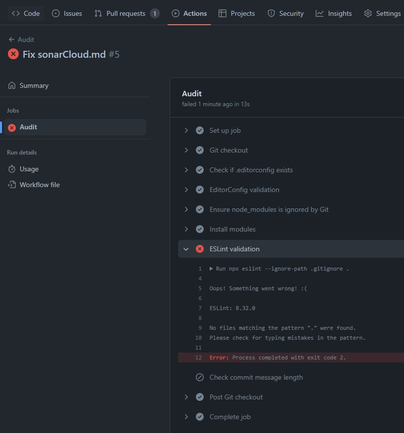

# Configurando gitHub actions

- Creamos en nuestro repositorio la carpeta .github/workflows/

- Añadimos el archivo audit.yml

```yml
name: Audit # Nombre del fichero .yml
on: push
jobs:
  audit:
    runs-on: ubuntu-latest
    name: Audit
    steps:
      - name: Git checkout
        uses: actions/checkout@v2
      - name: Check if .editorconfig exists
        uses: andstor/file-existence-action@v1
        with:
          files: ".editorconfig"
          allow_failure: true
      - name: EditorConfig validation
        uses: snow-actions/eclint@v1.0.1
      - name: Ensure node_modules is ignored by Git
        uses: dkershner6/gitignore-parser@v1
        with:
          must_deny: "node_modules/"
      - name: Install modules
        run: npm ci
      - name: ESLint validation
        run: npx eslint --ignore-path .gitignore .
      - name: Check commit message length
        uses: gsactions/commit-message-checker@v1
        with:
          pattern: "^[^#].{10,74}"
          error: "The commit message length must be between 10 and 72"
          excludeDescription: "true" # optional: this excludes the description body of a pull request
          excludeTitle: "true" # optional: this excludes the title of a pull request
          checkAllCommitMessages: "true" # optional: this checks all commits associated with a pull request
```

- La gitHubAction se ejecuta siempre desde las pulls request.

- Configurar la protección de rama:

  - Requerir review
  - No permitir bypass
  - Requerir status check (opcional)

## Soundcloud

- Para analizar el coverage tenemos que desactivar los métodos de análisis automáticos.

- Desde el proyecto de sonarCloud => Administration => Analysis methods

- Desactivamos automático y usamos gitHub Actions.

- Creamos el secret en github (Settings=>Secrets=>Actions) con el token y el valor que nos da SoundCloud.

- Pinchamos en create or update a build file y seleccionamos la opción "other".

- Copiamos el contenido que nos da (**o el modificado facilitado por Alejandro**, _se puede encontrar en la carpeta de este repositorio_) en un archivo creado en la carpeta .github/workflows/nombreQueQueramos.yml

```yml
name: Sonar
on:
  push:
    branches:
      - main
  pull_request:
    types: [opened, synchronize, reopened]
jobs:
  sonarcloud:
    name: SonarCloud
    runs-on: ubuntu-latest
    steps:
      - uses: actions/checkout@v2
        with:
          fetch-depth: 0 # Shallow clones should be disabled for a better relevancy of analysis
      - name: Install modules
        run: npm ci
      - name: Testing in production with coverage
        run: npm run test:prod #Change for a valid npm script
      - name: SonarCloud Scan
        uses: SonarSource/sonarcloud-github-action@master
        env:
          GITHUB_TOKEN: ${{ secrets.GITHUB_TOKEN }} # Needed to get PR information, if any
          SONAR_TOKEN: ${{ secrets.SONAR_TOKEN }}
```

## Dudas

¿Por qué da este error la github action audit.yml?

